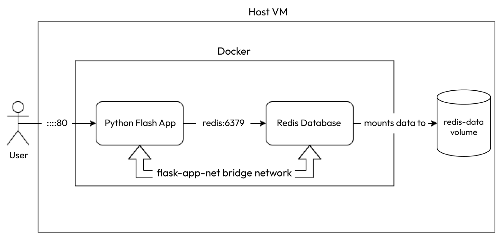

# Declarative container management with Docker Compose

`Docker Compose helps you manage multiple containers in a declarative way`. You can create a YAML file and specify what you want to build, what containers you want to run, and how the containers interact with each other. You can define mounts, networks, port mapping, and many different configurations in the YAML file.

After that, you can simply run `docker compose up` to run your entire containerized application.

`Declarative management` is quickly gaining ground because of its power and simplicity. Now, sysadmins don’t need to remember what commands they had run or write lengthy scripts or playbooks to manage containers. Instead, they can simply declare what they want in a YAML file, and docker compose or other tools can help them achieve that state. We installed Docker Compose when we installed Docker, so let’s see it in action with a sample application.

# Deploying a sample application with Docker Compose

We have a Python Flask application that listens on port `5000`, which we will eventually map to host `port 80`. The application will connect to the Redis database as a backend service on its default port, `6379`, and fetch the page’s last visit time. We will not expose that port to the host system. This means the database is entirely out of bounds for any external party with access to the application.

The following diagram depicts the application architecture:



# Creating the docker-compose file
The next step in the process is to create a `docker-compose` file. A `docker-compose file is a YAML file that contains a list of services, networks, volumes, and other associated configurations`. Let’s look at the following example docker-compose.yaml file to understand it better:

```yaml
    version: "2.4"
    services:
      flask:
        image: "bharamicrosystems/python-flask-redis:latest"
        ports:
          - "80:5000"
        networks:
          - flask-app-net
      redis:
        image: "redis:alpine"
        networks:
          - flask-app-net
        command: ["redis-server", "--appendonly", "yes"]
        volumes:
          - redis-data:/data
    networks:
      flask-app-net:
        driver: bridge
    volumes:
      redis-data:
```

The `YAML` file describes two services – `flask` and `redis`.

The flask service uses the `python-flask-redis:latest` image – the image we built with the preceding code. It also maps `host port 80` to `container port 5000`, exposing this application to your host machine on port 80, and you can access it via `http://localhost`.

The redis service uses the official redis:alpine image and does not expose any port, as we don’t want this service outside the container network’s confines. However, it declares a persistent volume, redis-data, that comprises the /data directory. We can mount this volume on the host filesystem for persistence beyond the container life cycle.

There is also a flask-app-net network that uses the bridge driver, and both services share the same network. This means the services can call each other by using their service names. If you look at the app.py code, you will see that we established a Redis service connection using the redis hostname.